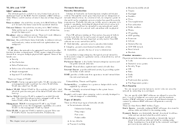
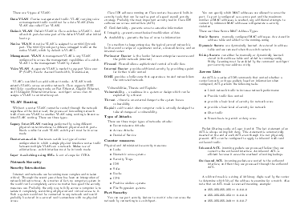

# CCNA Sumary

This is a CCNA Summary which is geared toward practical usage. Feel free to create a pull request for suggestions. This summary is based on the [LaTeX cheat sheet](http://wch.github.io/latexsheet/) by [Winston Chang](https://github.com/wch).

PNG images of the CCNA summary:

## Download

[PDF](https://github.com/roaldnefs/ccna/blob/master/summary.pdf) (A4) | [LaTeX](https://github.com/roaldnefs/ccna/blob/master/summary.tex)

## License

This work is licensed under a [Creative Commons Attribution 4.0 International License](http://creativecommons.org/licenses/by/4.0/).
